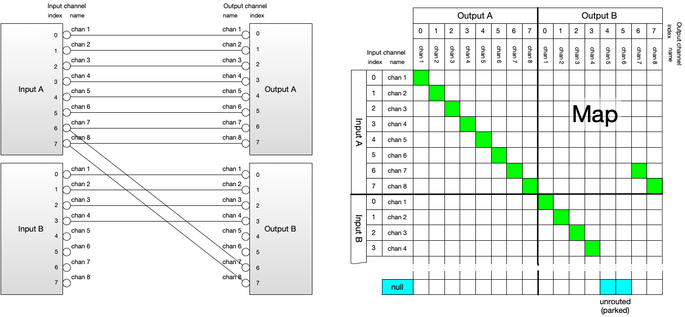
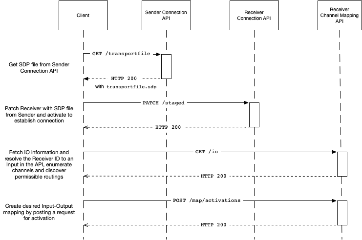
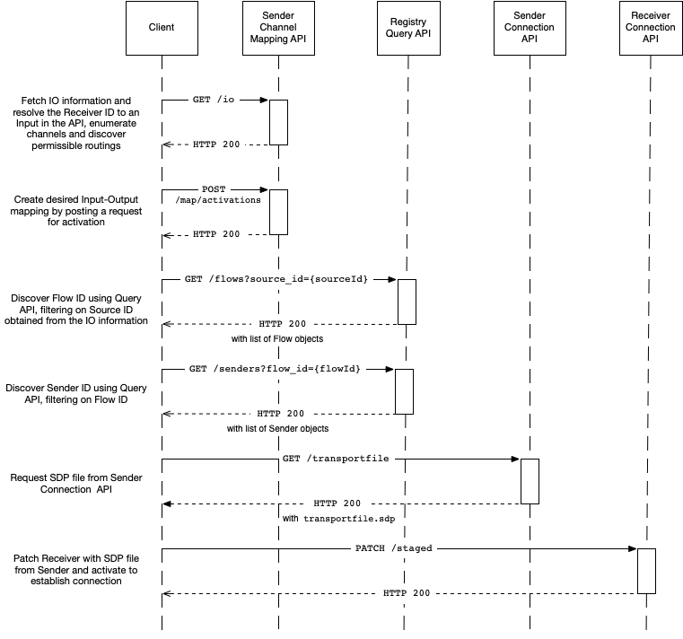

# AMWA NMOS Audio Channel Mapping Specification: Overview

_(c) AMWA 2018, CC Attribution-ShareAlike 4.0 International (CC BY-SA 4.0)_

## Documentation

The documents included in this directory provide additional details and recommendations for implementations of the defined API, and its consumers.

## Introduction

The purpose of this document is to explain how an NMOS compatible system can re-map audio channels. This can take place on a sending device, where the resulting re-mapped audio may be sent out over the network, or a receiving device, where audio received from the network may be re-mapped prior to consumption.

The terms 'Node', 'Device', 'Sender' and 'Receiver' will be used extensively throughout this document. Please refer to the core [NMOS Technical Overview](https://github.com/AMWA-TV/nmos/blob/master/NMOS%20Technical%20Overview.md) for definitions of these.

This API is intended to be used in conjunction with an [IS-04 NMOS Discovery and Registration](https://github.com/AMWA-TV/nmos-discovery-registration) deployment, however it has been written in such a way to provide useful functionality even in the absence of such a system.

This API may also be used on a Device that supports [IS-05 NMOS Device Connection Management](https://github.com/AMWA-TV/nmos-device-connection-management), but still provides useful functionality when used on Devices where connections are established by other means.

## Use of Normative Language
The documents included in this Directory form a normative part of the specification, along with the API definitions and schemas included in the [APIs directory](../APIs).

The key words "MUST", "MUST NOT", "REQUIRED", "SHALL", "SHALL NOT", "SHOULD", "SHOULD NOT", "RECOMMENDED", "MAY", and "OPTIONAL" in this document are to be interpreted as described in [RFC 2119](https://tools.ietf.org/html/rfc2119).

## Terminology

The API may be used to define a mapping between one or more audio "Inputs" and one or more audio "Outputs". Inputs and Outputs are resources local to the device, and as such are not published to the registry. An Input can be assigned audio from an NMOS Receiver, or can represent audio sources from elsewhere (e.g a microphone or physical input). Similarly audio routed to an Output can be assigned to an NMOS Source, or can be consumed elsewhere (e.g be routed to a loudspeaker or a physical output). A Device may also wish to direct audio from an Output back into a Device's Input, as a way of expressing complex Device routing limitations.

A Device may not be able to arbitrarily route audio from any Input to any Output. As such the API allows the Device it is running on to express these limitations.

Inputs and Outputs both have a number of Channels available for use. An Input represents each of the audio tracks assigned to it as a Channel. The number of channels an Input or Output has can be restricted by the Device, and cannot be altered by the client.

The relationship between Input channels and Output channels is defined by the "Map". Where a given Input is routable to a given Output, it MUST be possible to route any of the Input's channels to any channel of the Output. An Output channel that does not have an Input channel routed to it is said to be "unrouted" (sometimes known as "parked").

The following shows an example of an IS-08 Map between two eight-channel Inputs and two eight-channel Outputs, represented as a logical wiring diagram and as a routing matrix:



Note that:

- The eight Output A channels are routed as a block to the eight Input A channels. This could be due to hardware limitations on those channels, which can be signalled as a constraint in IS-08 (see below).
- Channels 7 and 8 of each Output are routed to the same Input A channels.
- Channels 5 and 6 of Output B are unrouted.


The above Map is represented in JSON in the API as below. See [Behaviour](4.0.%20Behaviour.md) for more details.

```json
"map": {
  "OutputA": {
    "0": {
      "input": "InputA",
      "channel_index": 0
    },
    "1": {
      "input": "InputA",
      "channel_index": 1
    },
    ... etc. ...
  },
  "OutputB": {
    "0": {
      "input": "InputB",
      "channel_index": 0
    },
    ... etc. ...
    "4": {
      "input": null,
      "channel_index": null
    },
    ... etc. ...
    "6": {
      "input": "InputA",
      "channel_index": 6
    },
    ... etc. ...
  }
}
```

The API has two representations of the Map. The "Active" Map describes the current channel mapping state of the Device. The Map's "Activations" represent the intended mapping changes of the Device at future points in time. An "Activation" is the process whereby the Active Map transitions to reflect the mapping changes. At the time of activation the underlying audio channel mapping behaviour of the Device transitions to reflect the new state of the Active map.

An Activation may either be "immediate", "relatively scheduled" or "absolutely scheduled". Immediate activations are carried out as soon as possible after the request is received and SHOULD be completed before the response is sent. A relatively scheduled activation is carried out after a period of time specified by the client has elapsed. An absolute activation is carried out at a specific time specified by the client.

## API Structure

The API is divided into the following parts:

### Inputs

The `inputs` resource and its child resources enumerate all of the Inputs, their channels and routing constraints. It also exposes the `parent` resource, which is used to indicate the origin of the audio associated with that Input.

These resources are read only.

### Outputs

The `outputs` resource and its child resources enumerate all of the Outputs, including restrictions on which Inputs may be routed to an Output, and an optional Source ID, which represents the new NMOS Source created by re-mapping the audio.

These resources are read only.

### Map

The `map` resource has child resources that represent the Active Map and any pending Activations. The Active Map is not directly modifiable by the client - changes must be made by POSTing Activations.

### Inputs/Outputs View

The `io` resource is simply a view onto data available elsewhere in the API, in order to allow clients to gather the information they need about inputs and outputs in a single request.

This resource is read only.

## API Interaction

The following sequence diagrams show the expected interactions with the IS-04 registry, a device's IS-05 Connection API and its Channel Mapping API in order to route a channel mapped audio stream to a receiver.

The mapping can either take place on the receiving Device itself, or on the sending Device, depending on the capabilities and requirements of the system.

### Receiver Side Sequence Diagram



### Sender Side Sequence Diagram


