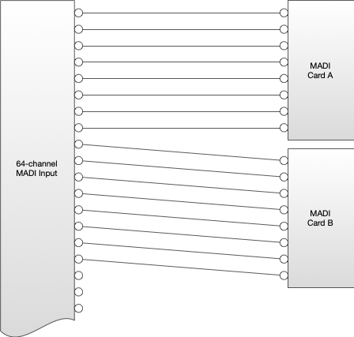
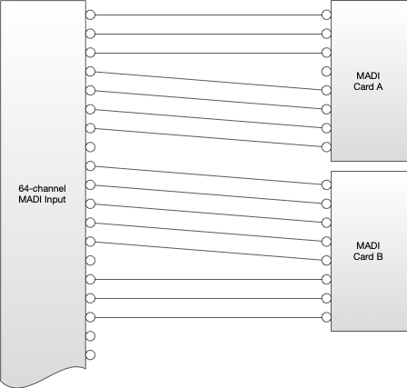
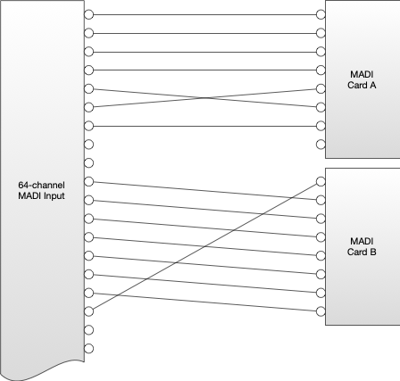
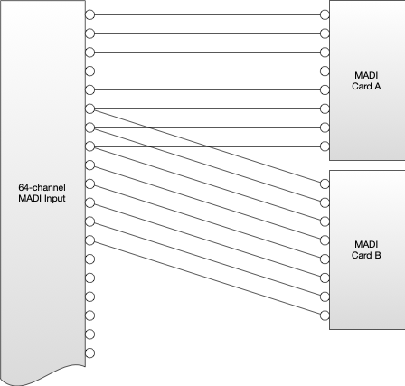
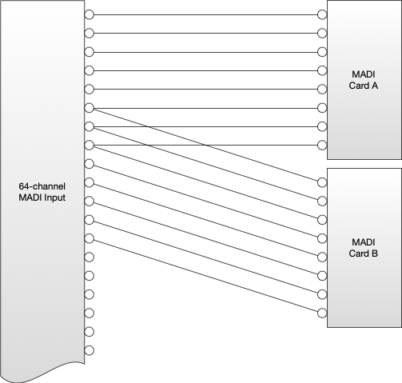
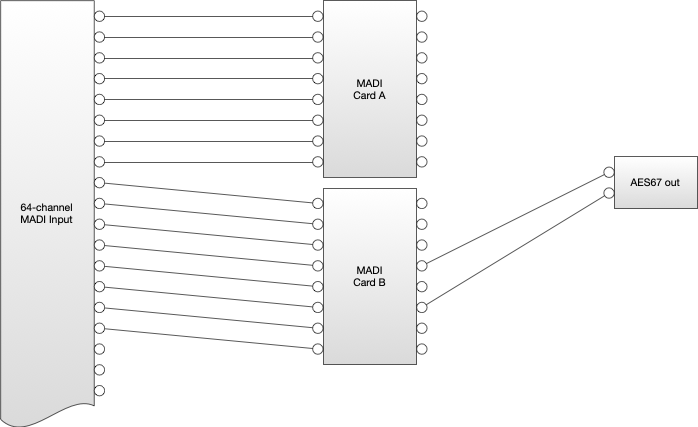

# Behaviour

_(c) AMWA 2018, CC Attribution-ShareAlike 4.0 International (CC BY-SA 4.0)_

## Start-Up Behaviour

This specification does not define the channel mapping behaviour at start-up, as this may depend on the nature of the Device the API is controlling. However - it is important that the channel mapping behaviour of the underlying Device is reflected in the API at start-up.

## Interaction with Other Protocols

If the audio channel mapping behaviour of the Device is changed via another protocol or control interface the Device MUST update the information in the audio channel mapping API to accurately reflect the current behaviour of the Device.

## Inputs and Outputs

### Identifiers

Inputs and Outputs are represented by a unique identifier. This identifier MUST conform to the following regex pattern:

```regex
^[a-z A-Z 0-9 \- _]+$
```

All Input and Output identifiers MUST be immutable. Two Inputs MUST NOT share an identifier. Two Outputs MUST NOT share an identifier.

### Output and Source Relationship

The `sourceid` resource of an Output SHOULD be populated with a Source ID when audio is mapped to an Output, if:

* It is or may be passed directly to an NMOS Sender within the same Device.

* It is or may be passed to another process within the Device which is capable of performing a transformation on the Source that would constitute a new Source and or Flow.

* It is or may be passed to another process within the Device that would not constitute the creation of a new Source or Flow, but would or may then route it's resultant output to an NMOS Sender.

* It is routed back to the Input of the Audio Channel Mapping API, as part of a re-entrant matrix (see [Re-Entrant Matrices](###re-entrant-matrices)).

Otherwise, the `sourceid` shall be set to `null`.

In the case where no audio is currently mapped onto an Output (i.e all its entries in the active map are `null`) then the Output still constitutes a Source, and as such the `sourceid` resource for the Output SHOULD still present a Source ID where it would otherwise be required to do so.

### Receiver / Source and Input Relationship

Where the audio associated with an Audio Channel Mapping API Input comes directly from an NMOS Receiver, the UUID of the originating Source SHOULD be populated in `id` field of the `parent` resource, and the `type` filed set to `source`. This information may be made available using in-stream identifiers, or some sidecar method of reception.

```json
{
  "id": "bdec047b-d161-492a-9496-96da704de2b1",
  "type": "source"
}
```

If information about the Source ID is not available, then the UUID of the Receiver SHOULD appear in the `id` field of the `parent` resource of the associated Input (e.g inputs/input1/parent). When the `parent` resource is populated with a Receiver ID, the `type` field SHALL be populated with the string `receiver`.

```json
{
  "id": "a7250200-30ae-4866-9aeb-721f3f63f58d",
  "type": "receiver"
}
```

It is possible that received audio may have undergone one or more Source creating transformations between Receiver and the Audio Channel Mapping API. In this case, the `id` field of the `parent` resource SHOULD contain the id of the upstream Source. The `type` field should contain the string `source`.

```json
{
  "id": "bdec047b-d161-492a-9496-96da704de2b1",
  "type": "source"
}
```

If the audio did not originate with an NMOS Receiver and has not yet been represented as an NMOS Source, both fields in the `parent` resource SHOULD be set to `null`.

```json
{
 "id": null,
 "type": null
}
```

In the case where an Input is not currently receiving any audio, but would pass any audio received in the future onto its Output, then the `parent` resource SHOULD be populated with the Receiver or Source ID it is associated with as it would if receiving audio. For example, if an NMOS Receiver is not currently receiving a stream, but would pass any audio it received in future onto an Audio Channel Mapping API Input then that input's `parent` field should be populated as if it were currently receiving audio from that Receiver.

### Channels

Inputs and Outputs MUST have at least one channel listed in their `channels` resource. For some Devices the number of channels will be fixed - for example where an Input or Output represents a base-band connection to a Device such as analogue audio or AES3.

Other Devices may be capable of dynamically creating or destroying channels, for example where the Input or Output represents an audio stream. The Audio Channel Mapping API does not provide a mechanism for changing the number of channels in an Input or Output resource - this must be done through an out-of-band operation by the user or automatically by the Device.

A change to the number of channels in an Input or Output MUST be represented in the Input or Outputs own `channels` resource, but also MUST be represented in the global `map/active` and `map/staged` resources - and in the global `io` resource.

Newly created Output channels SHOULD start un-routed with the `input` and `channel_index` properties for the channel in the map table being set to `null`. The decision as to which channels are deleted when the number of channels are removed is left as a decision to implementers, as it is likely to depend on the application of the Device.

Where a channel is added to or removed from an Output this represents the creation of a new Source.

### Input Constraints

Inputs may optionally constrain the way the channels contained in the Input may be routed, using the parameters exposed in the `caps` resource.

If a client attempts to create a mapping that would violate these constraints the API SHOULD return an HTTP 400 response. This response SHOULD contain a message informing the client that the request was rejected because it did not respect an input constraint and also provide information about which constraint was broken, and for which channels/Inputs, in order to aid debugging.

#### Re-ordering

In some cases Inputs may not be capable of performing a re-ordering operation with their channels. In this case the Audio Channel Mapping API may be thought of as being used more as a way of routing multiple channels of audio within a Device, rather than re-ording them. This is illustrated in the diagram below, where channels from a 64 channel MADI input may be mapped into an 8 channel MADI card:



Where an Input is constrained in this way the `reordering` parameter in the Input's `caps` resource SHALL be set to `false`. This indicates that, where more than one channel from the Input is mapped to an Output the resultant mapping must preserve the ordering and separation of the channels such that:

* The difference between Input and Output channel indexes MUST be numerically equal for all channels in the mapping between a particular Input and Output.
* Channels with a lower Input channel index MUST be mapped to a lower Output channel index than channels from the same Input which have a higher Input index that are mapped to the same Output.

For example a mapping like that shown in the diagram above would be permissible if `reordering` were set to `true`, but those below would not:





However - the following examples ARE permissible, as the difference in offsets occurs across two different Outputs:




#### Channel Block Sizes

Some Devices place a further constraint that channels must be treated as a discrete block from a given Input, where all channels in the block are expected to be routed together from a certain starting point, such that:

* It MUST be be that all Input channels in a block are routed to an Output, or none at all.
* All Input channels in a block MUST be routed to the same Output when routed.
* An Input channel MUST only be in one block.
* All Input channels MUST be in a block.
* All blocks MUST be the same size.
* All blocks MUST start with an input channel index being a multiple of the `block_size` parameter or 0.

Where an Input is constrained in this way the `block_size` parameter in the Input's `caps` resource SHALL be an integer indicating the block size that is in use for that Input and the resulting Input Channel start. Otherwise the `block_size` parameter SHALL be set to `1`.

The following example describes a case, where the specific arcitecture of a given MADI Card allows only to either process Inputs 1-8, 9-16, 17-24, and so on from a given MADI Signal. The following output would be permissible, where a `block_size` value of `8` is used:


->> add a picture of Signals 1-8 routed to MADI Card B, or Signals 9-16 routed to MADI Card A.

The following examples would not be permissible:




#### Combining Input Constraints

The `block_size` and `reordering` parameters may both be used at the same time, to express a constraint where channels must be treated as blocks, and re-ordering in those blocks is not permitted. For example, the following would no longer be permitted when using a `block_size` of `8` when the `reordering` parameter is set to `false`:


### Output Routing Constraints

It is recognised that not all Devices allow the routing of channels in any Input to any Output. In order to reflect this limitation, the Output `caps` resource presents a list of rout-able Inputs in the `routable_inputs` field. If such restrictions exist then they MUST be populated by the Device, such that if an Input is listed in an Output's rout-able input list then channels from that input can be routed to that Output in the Map table. If no such restrictions exist, the `routable_inputs` field MUST be set to `null`.

Clients SHOULD NOT attempt to route channels from Inputs to an Output unless that Input is listed in the Output's `routable_inputs` array. If a client attempts to make such a route the API SHOULD respond with an HTTP 400 response. This error message SHOULD inform the client that it attempted to make an illegal route, and which inputs/outputs were involved in the illegal route.

## Map

### The Map Structure

Both the `staged` and `active` resources contain a structure called `map`, which looks like the following:

```json
"map":{
  "outA":{
    "0" :{
      "input": "input1",
      "channel_index": 0
    },
    "1":{
      "input": "input1",
      "channel_index": 1
    }
  },
  "outB":{
    "0":{
      "input": "input4",
      "channel_index": 0
    },
    "1":{
      "input": null,
      "channel_index": null
    }
  }
}
```

The keys in the map object are the identifiers of all the Outputs in the API. Every Output has an object within the `map` object to represent it. Keys within an Output object represent channels in the Output, and are the JSON array index of the channel in the Output's `channels` resource.

Each channel contains two fields - `input` and `channel_index`. `channel_index` is the JSON array index of the Input channel routed to that Output channel, as indicated by the Input's `channels` resource. `input` is the identifier of the Input to which the routed channel belongs.

If no Input channel is being routed to an Output channel, both `input` and `channel_index` MUST be set to `null`. Any attempt to patch one of the two fields within a Output channel object to `null` without setting the other SHOULD result in an HTTP 400 response. In this error scenario the API SHALL NOT modify the map resource in any way, even if some of the routes in the failed request would have been valid. If an activation request is included in a failed stage request that activation MUST be ignored.

Where an Output does not have a channel routed to it the Device MUST interpret this as silence, and produce a silent signal of appropriate bit depth / bit rate from that output.

### Staging Parameters

When PATCHing the `staged` map resource clients MAY use a subset of the schema, such that only the entries to be updated are included. The API MUST leave values not expressly updated in the PATCH request un-changed.

Changes to the `staged` map MUST NOT result in any changes to the Device audio channel mapping behaviour until there is an activation.

In the event that the stage request attempts to perform a routing operation that is not permitted by the Input or Output routing constraints the API SHOULD respond with an HTTP 400 error response. The API SHALL NOT modify the map resource in any way, even if some of the routes in the failed request would have been valid. If an activation request is included in a failed stage request that activation MUST be ignored.

### Activation of Staged Parameters

#### Activation Requests

In order to trigger an activation a client PATCHes the `activation` object in the `map/staged` endpoint. The `mode` property MAY be set to any one of the following four values:

- `activate_immediate` - The Device MUST undertake to apply the staged parameters to the underlying audio processing as soon as possible.
- `activate_scheduled_absolute` - The Device MUST activate the staged parameters as close as possible to the absolute time indicated by the timestamp in the `requested_time` field. The timestamp MUST be treated as a TAI timestamp, as detailed in the [Timestamps](###Timestamps) sub-section.
- `activate-scheduled_relative` - The Device MUST activate the staged parameters as close as possible to the relative time in seconds indicated by the `requested_time` field. See the [Timestamps](###Timestamps) Section for details on the format of this timestamp.
- `null` - The Device is not expected to perform an activation. This value is the default which the `mode` parameter will return to after an activation, and may also be PATCHED by the client to cancel a pending scheduled activation of either kind.

#### Activation Responses

Note the presence of the extra `activation_time` parameter in the response schema. For immediate activation this SHOULD be the time the activation actually occurred as an absolute TAI timestamp. If no activation was requested in the PATCH `activation_time` MUST be set null.

An HTTP 200 response SHOULD be returned for PATCH requests where no activation has been scheduled, an activation has been cancelled, or an immediate activation has been requested. The response will always contain the full set of parameters in the response schema. For a request with an immediate activation the API SHOULD only return a response once the new map has been applied to the audio.

An HTTP 202 response SHOULD be returned when a request for a scheduled activation is accepted, to indicate that while the request itself was acceptable it has not yet been acted upon by the sender. For scheduled activations `activation_time` should be the absolute TAI time the parameters will actually transition. For absolute scheduled activations SHOULD be the same as the requested time, but may differ if the Device is unable to schedule at the requested time.

An HTTP 423 response SHOULD be returned when the resource is locked because an activation has already been scheduled. A resource may be unlocked by setting mode in activation to `null`, which will cancel the pending activation. This may be done in the same request as a change to other parameters.

Note that for activations the `mode` parameter MUST return to null once the activation transaction with the client is completed (i.e the response to the PATCH has been sent by the server).

### Timestamps

All timestamps in this API SHALL be string formatted timestamps (\<seconds\>:\<nanoseconds\>) indicating time (absolute or relative) for activation. For relative times, the time '0:0' SHALL be considered to be the time the request is received by the API.

In order to ensure consistent operation of the API during and around leap seconds the API SHALL use TAI for all absolute timestamps. TAI does not apply leap seconds, and is therefore an integer number of seconds different to UTC. The timestamps used in the API SHALL be based on the UNIX epoch, meaning 1970-01-01 00:00:00 TAI would be represented as '0:0'.

Devices receiving their time references in UTC MUST maintain an up-to-date knowledge of when leap seconds will be applied in order to correctly calculate TAI time. Leap second information is available for the [International Earth Rotation and Reference System Service (IERS)](https://www.iers.org/IERS/EN/Home/home_node.html).

### Re-entrant Matrices

Some Devices have more complex routing requirements. For example, a Device may have a large number of channels on an input, but restrictions in DSP capacity may mean that only a limited sub-set of these channels can be routed at any given time. For example, the Device illustrated below has a 64 channel MADI Input, but a limited number of MADI cards, meaning it can only process 16 of the 64 channels at any one time. Any of the outputs of the MADI cards can then be routed to a two channel AES67 output.



In this scenario the audio undergoes two distinct routing operations - the first from the MADI input to the MADI card, and then a second from the MADI card to the AES67 output. In order to allow for these kinds of restrictions the Audio Channel Mapping API allows for the concept of a re-entrant matrix. Audio at an Output may be routed back to an Input. This is signalled to the control system by the same Source ID being present in both the Output's `sourceid` resource and also the Input's `parent` resource.

Where this is done the Device MUST ensure that the Output constraints prevents audio being routed such that a loop is formed, which is to say audio must not be able to be routed back to the Output from which it originated.

## IO Resource

The IO resource provides a structure detailing all Inputs, Outputs and available mappings between them.

The object returned from this resource contains an Input object and an Output object. These objects contain objects representing each of the Inputs/Outputs. These objects contain a list of channels available, and the ReceiverID/SourceID associated with the Input/Output respectively. This information MUST match the information available in the Input's/Output's own resources, including the array order or the `channels` resources.
