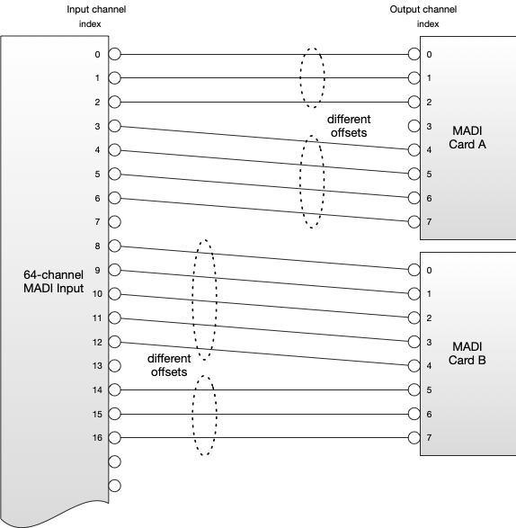
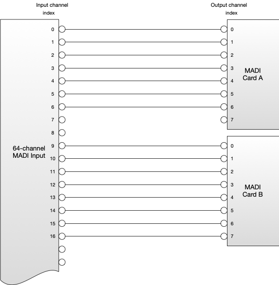
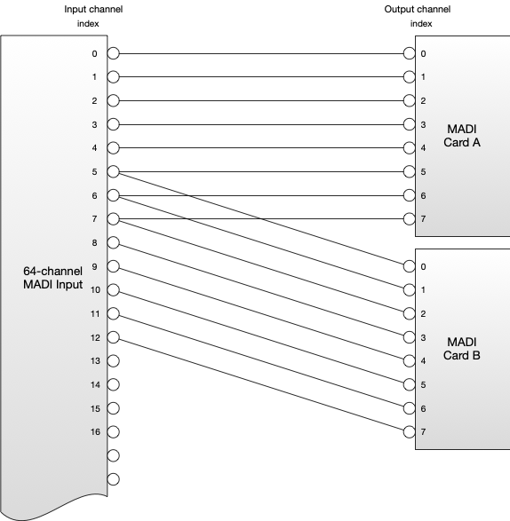
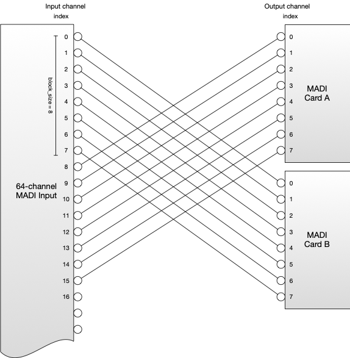
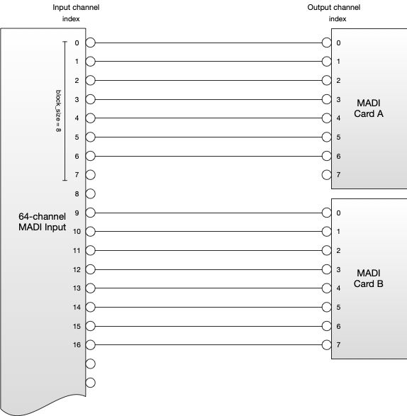
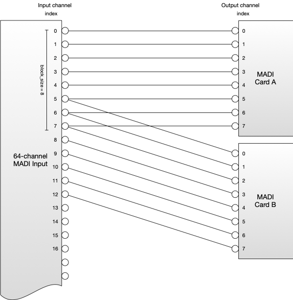
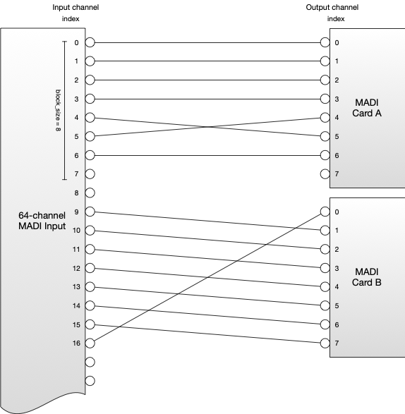
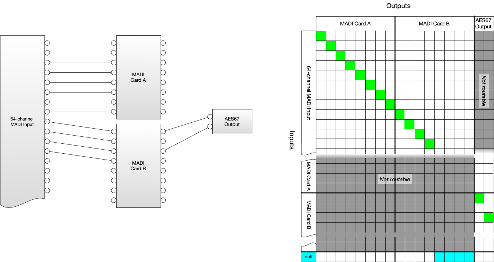

# Behaviour

_(c) AMWA 2018, CC Attribution-ShareAlike 4.0 International (CC BY-SA 4.0)_

## Start-Up Behaviour

This specification does not define the channel mapping behaviour at start-up, as this may depend on the nature of the Device the API is controlling. However, it is important that the channel mapping behaviour of the underlying Device is reflected in the API at start-up.

## Interaction with Other Protocols

If the audio channel mapping behaviour of the Device is changed via another protocol or control interface the Device MUST update the information in the Channel Mapping API to accurately reflect the current behaviour of the Device.

## Inputs and Outputs

### Identifiers

Inputs and Outputs are represented by a unique identifier. This identifier MUST conform to the following regex pattern:

```regex
^[a-zA-Z0-9\-_]+$
```

All Input and Output identifiers MUST be immutable. Two Inputs MUST NOT share an identifier. Two Outputs MUST NOT share an identifier.

### Properties

Inputs and Outputs MUST also provide a human-readable name and description in the `props` resource, intended to be exposed in control systems.

These are distinct from the machine readable unique identifier.

### Output and Source Relationship

The `sourceid` resource of an Output SHOULD be populated with a Source ID when audio is mapped to an Output, if:

* It is or may be passed directly to an NMOS Sender within the same Device.

* It is or may be passed to another process within the Device which is capable of performing a transformation on the Source that would constitute a new Source and or Flow.

* It is or may be passed to another process within the Device that would not constitute the creation of a new Source or Flow, but would or may then route its resultant output to an NMOS Sender.

* It is routed back to the Input of the Channel Mapping API (see [Re-entrant Mappings](#re-entrant-mappings)).

Otherwise, the `sourceid` MUST be set to `null`.

In the case where no audio is currently mapped onto an Output (i.e all its entries in the active map are `null`) then the Output still constitutes a Source, and as such the `sourceid` resource for the Output SHOULD still present a Source ID where it would otherwise be required to do so.

### Receiver / Source and Input Relationship

Where the audio associated with a Channel Mapping API Input comes directly from an NMOS Receiver, the UUID of the originating Source SHOULD be populated in `id` field of the `parent` resource, and the `type` field set to `source`. This information may be made available using in-stream identifiers or using some out-of-band method.

```json
{
  "id": "bdec047b-d161-492a-9496-96da704de2b1",
  "type": "source"
}
```

If information about the Source ID is not available, then the UUID of the Receiver SHOULD appear in the `id` field of the `parent` resource of the associated Input (e.g inputs/input1/parent). When the `parent` resource is populated with a Receiver ID, the `type` field MUST be populated with the string `receiver`.

```json
{
  "id": "a7250200-30ae-4866-9aeb-721f3f63f58d",
  "type": "receiver"
}
```

It is possible that received audio may have undergone one or more Source creating transformations between Receiver and the Channel Mapping API. In this case, the `id` field of the `parent` resource SHOULD contain the id of the upstream Source. The `type` field should contain the string `source`.

```json
{
  "id": "bdec047b-d161-492a-9496-96da704de2b1",
  "type": "source"
}
```

If the audio did not originate with an NMOS Receiver and has not yet been represented as an NMOS Source, both fields in the `parent` resource SHOULD be set to `null`.

```json
{
 "id": null,
 "type": null
}
```

In the case where an Input is not currently receiving any audio, but would pass any audio received in the future onto its Output, then the `parent` resource SHOULD be populated with the Receiver or Source ID it is associated with as it would if receiving audio. For example, if an NMOS Receiver is not currently receiving a stream, but would pass any audio it received in the future onto a Channel Mapping API Input, then that input's `parent` field should be populated as if it were currently receiving audio from that Receiver.

### Channels

Inputs and Outputs MUST have at least one channel listed in their `channels` resource. For some Devices the number of channels will be fixed - for example where an Input or Output represents a base-band connection to a Device such as analogue audio or AES3.

Other Devices may be capable of dynamically creating or destroying channels, for example where the Input or Output represents an audio stream. The Channel Mapping API does not provide a mechanism for changing the number of channels in an Input or Output resource - this must be done through an out-of-band operation by the user or automatically by the Device.

A change to the number of channels in an Input or Output MUST be represented in the Input's or Output's own `channels` resource, but also MUST be represented in the global `map/active` and `map/activations` resources - and in the global `io` resource.

Newly created Output channels SHOULD start unrouted, with the `input` and `channel_index` properties for the channel in the map table being set to `null`. The decision as to which channels are deleted when the number of channels are removed is left as a decision to implementers, as it is likely to depend on the application of the Device.

Where a channel is added to or removed from an Output this represents the creation of a new Source.

### Input Constraints

Inputs may optionally constrain the way the channels contained in the Input may be routed, using the parameters exposed in the `caps` resource.

If a client attempts to create a mapping that would violate these constraints the API SHOULD return an HTTP 400 response. This response SHOULD contain a message informing the client that the request was rejected because it did not respect an input constraint and also provide information about which constraint was broken, and for which channels and Inputs, in order to aid debugging.

To illustrate Input constraints the following examples relate to mapping channels from 64-channel MADI ([Multichannel Audio Digital Interface, AES10](http://www.aes.org/publications/standards/search.cfm?docID=17)) Input onto a pair of 8-channel MADI Outputs.

#### Re-ordering

In some cases Inputs may not be capable of performing a re-ordering operation with their channels. In such cases the Channel Mapping API may be considered as a means of routing multiple channels of audio within a Device, rather than re-ordering channels, as in the following example:


If the Input is constrained in this way, i.e. it cannot perform re-ordering, the `reordering` parameter in the Input's `caps` resource MUST be set to `false`, and there MUST be a fixed offset for all Input and Output channel indexes in the mapping.

For example, the following two mappings are only permissible if `reordering` is set to `true`:




However, the following two examples would be permissible if `reordering` is set to `false`, as the difference in offsets occurs across two different Outputs;
the gap in the  channels used from Input does not correspond to a gap within an Output.  (However block constraints can make such an example not permitted – see below.)





#### Channel Block Sizes

Some Devices place a further constraint that channels must be treated as a discrete block from a given Input, where all channels in the block are expected to be routed together from a certain starting point, such that:

* It MUST be that either all Input channels in a block are routed to an Output, or none are routed.
* All Input channels in a block MUST be routed to the same Output when routed.
* An Input channel MUST only be in one block.
* All Input channels MUST be in a block.
* All blocks MUST be the same size.
* All blocks MUST start with an input channel where `channel_index` is zero or a multiple of the `block_size` parameter.

Where an Input is constrained in this way the `block_size` parameter in the Input's `caps` resource MUST be an integer indicating the block size that is in use for that Input and the resulting Input Channel start. Otherwise the `block_size` parameter MUST be set to `1`.

Consider a case where the specific architecture of a given MADI Card only allows processing of Input channels in blocks. The MADI channel numbers and corresponding Input `channel_index` values of these blocks are `0`-`7`, or `8`-`15`, or `16`-`23`, and so on.

The following examples would be permissible, where a `block_size` value of `8` is used:




The following examples would not be permissible:





#### Combining Input Constraints

The `block_size` and `reordering` parameters may both be used at the same time, to express a constraint where channels must be treated as blocks, and re-ordering in those blocks is not permitted. For example, the following would no longer be permitted when using a `block_size` of `8` when the `reordering` parameter is set to `false`:



### Output Routing Constraints

It is recognised that not all Devices allow the routing of channels in any Input to any Output. In order to reflect this limitation, the Output `caps` resource presents a list of routable Inputs in the `routable_inputs` field. If such restrictions exist then they MUST be populated by the Device, such that if an Input is listed in an Output's routable input list then channels from that input can be routed to that Output in the Map table. If no such restrictions exist, the `routable_inputs` field MUST be set to `null`.

Clients SHOULD NOT attempt to route channels from Inputs to an Output unless that Input is listed in the Output's `routable_inputs` array. If a client attempts to make such a route the API SHOULD respond with an HTTP 400 response. This error message SHOULD inform the client that it attempted to make an illegal route, and which inputs/outputs were involved in the illegal route.

## Map

### The Map Structure

The `active` resource contain a structure called `map`, which looks like the following:

```json
"map":{
  "outA":{
    "0" :{
      "input": "input1",
      "channel_index": 0
    },
    "1":{
      "input": "input1",
      "channel_index": 1
    }
  },
  "outB":{
    "0":{
      "input": "input4",
      "channel_index": 0
    },
    "1":{
      "input": null,
      "channel_index": null
    }
  }
}
```

The keys in the map object are the identifiers of all the Outputs in the API. Every Output has an object within the `map` object to represent it. Keys within an Output object represent channels in the Output, and are the JSON array index of the channel in the Output's `channels` resource.

Each channel contains two fields - `input` and `channel_index`. `channel_index` is the JSON array index of the Input channel routed to that Output channel, as indicated by the Input's `channels` resource. `input` is the identifier of the Input to which the routed channel belongs.

If no Input channel is being routed to an Output channel, both `input` and `channel_index` MUST be set to `null`.
Where an Output does not have a channel routed to it the Device MUST interpret this as silence, and produce a silent signal of appropriate bit depth and bit rate from that output.

### Activation Requests

Activations are the mechanism by which changes are made to the `active` resource. Activations can either be immediate or scheduled.
In either case an activation may be made by performing a POST request to the `activations` endpoint.

When POSTing to the `activations` resource clients MUST use a subset of the map resource, such that only the entries to be updated are included. The API MUST leave values not expressly updated in the POST request unchanged by the activation.

The submission of a scheduled activation MUST NOT result in any changes to the Device audio channel mapping behaviour until the activation time is reached.

In order to trigger an activation a client POSTs `activation` and `map` objects in the `activations` endpoint.
The Device MUST undertake to apply the parameter changes to the underlying audio processing as close as possible to the time indicated by the `mode` property in the `activation` object, as follows:

- `activate_immediate` - on message receipt
- `activate_scheduled_absolute` - the absolute time indicated by the `requested_time` field
- `activate_scheduled_relative` - the relative time after message receipt indicated by the `requested_time` field

See the [Timestamps](#Timestamps) section for more details on the required interpretation of the timestamps for scheduled activations.

Once an activation has been completed the resulting changes to the map MUST be reflected in the `active` endpoint. The `activation` object in the `active` endpoint MUST contain the details of the last activation to have taken place.

#### Activation Responses

Each successful activation request is allocated a unique identifier by the API. This identifier MUST be unique within an API instance and for all time.

Pending scheduled activations, along with their ID, are listed in the `activations` resource until they activate. Once activated they MUST be removed from the resource. Immediate activations MUST NOT appear in the `activations` list, as they are carried out upon arrival.

The unique identifier is returned as part of the activation response, to allow the client to cancel scheduled activations if required.

Note the presence of the extra `activation_time` parameter in the response schema. For immediate activation this SHOULD be the time the activation actually occurred as an absolute TAI timestamp.

An HTTP 200 response MUST be returned when an immediate activation has been successfully requested. For a request with an immediate activation the API SHOULD only return a response once the new map has been applied to the audio.

An HTTP 202 response MUST be returned when a request for a scheduled activation is accepted, to indicate that while the request itself was acceptable it has not yet been acted upon by the sender. For scheduled activations `activation_time` SHOULD be the absolute TAI time the parameters will actually transition. For absolute scheduled activations SHOULD be the same as the requested time, but may differ if the Device is unable to schedule at the requested time.

When there is an error in the request, the API MUST reject the entire request with an appropriate 4xx response. Particular responses MUST be used in the following cases:

| Error | HTTP Response |
| --- | --- |
| Output is modified by an already scheduled activation. | 423 (Locked) |
| Routing request not permitted by Input or Output constraints. | 400 (Bad Request) |
| One field of Output channel object is `null` but other is not. | 400 (Bad Request) |

#### Canceling Activations

A client cancels an activation by submitting a DELETE request to the resource `/map/activations/{activationId}`. If the activation has already been completed the API MUST respond with an HTTP 404 error response, as the activation no longer exists.

### Timestamps

Timestamps indicate the absolute or relative time for activation and MUST be string formatted as `<seconds>:<nanoseconds>`. Absolute timestamps MUST be based on TAI (which does not apply leap seconds) and must use SMPTE epoch (meaning 1970-01-01 00:00:00 TAI would be represented as `0:0`).

Devices receiving their time references in UTC MUST maintain an up-to-date knowledge of when leap seconds will be applied in order to correctly calculate TAI time. Leap seconds are announced by the [International Earth Rotation and Reference System Service (IERS)](https://www.iers.org/SharedDocs/News/EN/BulletinC.html) and the IETF publish an [adjustment table](https://www.ietf.org/timezones/data/leap-seconds.list).

### Re-entrant Mappings

Some Devices have more complex routing requirements. For example, a Device may have a large number of channels on an input, but restrictions in DSP capacity may mean that only a limited sub-set of these channels can be routed at any given time. For example, the Device illustrated below has a 64 channel MADI Input, but a limited number of MADI cards, meaning it can only process 16 of the 64 channels at any one time. Any of the outputs of the MADI cards can then be routed to a two channel AES67 output.



In this example we indicate which inputs can be routed to the AES67 output with `/outputs/aes67/caps` as follows:
```json
{
  "routable_inputs": [
    "madi-a",
    "madi-b"
  ]
}
```

And the re-entrant mapping is represented with `/map/active/aes67`:
```json
{
  "aes67":{
    "0":{
      "input": "madi-b",
      "channel_index": 0
    },
    "1":{
      "input": "madi-b",
      "channel_index": 2
    }
  }
}
```

In this scenario the audio undergoes two distinct routing operations - the first from the MADI input to the MADI card, and then a second from the MADI card to the AES67 output. In order to allow for these kinds of restrictions the Channel Mapping API supports re-entrant mappings, in which audio at an Output may be routed back to an Input. This is signaled to the control system by the same Source ID being present in both the Output's `sourceid` resource and also the Input's `parent` resource.

Where this is done the Device MUST ensure that the Output constraints prevents audio being routed such that a loop is formed, which is to say audio must not be able to be routed back to the Output from which it originated.

## IO Resource

The IO resource provides a structure detailing all Inputs, Outputs and available mappings between them.

The object returned from this resource contains an Input object and an Output object. These objects contain objects representing each of the Inputs and Outputs. These objects contain a list of channels available, and the ReceiverID/SourceID associated with each Input/Output respectively. This information MUST match the information available in the Input's/Output's own resources, including the array order of the `channels` resources.
